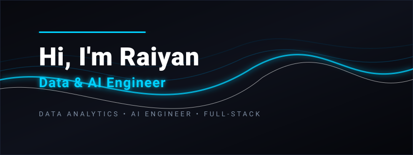

<p align="center">
  
</p>

<p align="center">
  <a href="https://www.linkedin.com/in/mohammed-raiyan21/"></a>
  <a href="https://mdraiyan.vercel.app/"></a>
  <a href="mailto:mohammedraiyaneajas@gmail.com"></a>
</p>

---

## 🚀 About Me

A final-year **Computer Science Engineering** student specializing in **Data Analytics**, **Business Intelligence (BI)**, **Process Automation**, and **AI-powered systems**. I design and build end-to-end data pipelines, automation workflows, custom dashboards, and full-stack software applications to turn raw data into actionable business insights.

### ⚡ What Drives Me
I am passionate about turning complex, manual processes into automated, efficient workflows. Whether it's designing clean Power BI dashboards, developing computer vision systems, or engineering full-stack platforms, I believe that technology should work seamlessly in the background to make operations simpler and decision-making faster.

---

## 📌 Featured Projects

<table width="100%">
  <tr>
    <td width="33.3%" valign="top">
      <h3>💬 AI Portfolio Assistant</h3>
      <p><strong>Retrieval-Augmented Generation (RAG)</strong></p>
      <p>An AI-powered portfolio assistant using RAG, LangChain, Pinecone, and Groq LLM to deliver fast, context-aware answers about my projects and skills.</p>
      <p><strong>Key Impacts:</strong></p>
      <ul>
        <li>Fast, context-aware responses from a custom knowledge base.</li>
        <li>Semantic search using Pinecone vector database and sentence transformers.</li>
      </ul>
      <p><strong>Tech Stack:</strong> React, FastAPI, LangChain, Pinecone, Groq</p>
      <p><a href="https://mdraiyan.vercel.app/"><strong>Launch Application ↗</strong></a></p>
    </td>
    <td width="33.3%" valign="top">
      <h3>🏍️ Intelligent Helmet Detection</h3>
      <p><strong>Computer Vision &amp; IoT Control</strong></p>
      <p>A real-time helmet detection system and automated vehicle ignition override control pipeline to enforce rider safety in smart cities.</p>
      <p><strong>Key Impacts:</strong></p>
      <ul>
        <li>Achieved 93% mAP using YOLOv8 trained on 5,696 images.</li>
        <li>Automated ignition override via Arduino (UART) under 2 seconds.</li>
      </ul>
      <p><strong>Tech Stack:</strong> Python, YOLOv8, OpenCV, Arduino, IoT</p>
      <p><a href="https://github.com/mohammedraiyan05/INTELLIGENT-HELMET-DETECTION-WITH-AUTOMATED-VEHICLE-CONTROL-USING-COMPUTER-VISION"><strong>View Repository ↗</strong></a></p>
    </td>
    <td width="33.3%" valign="top">
      <h3>📊 Automated Sales KPI Workflow</h3>
      <p><strong>Process Automation &amp; Agents</strong></p>
      <p>An end-to-end automated pipeline computing sales metrics, generating charts, and emailing AI-summarized insights using n8n workflows.</p>
      <p><strong>Key Impacts:</strong></p>
      <ul>
        <li>Reduced manual reporting time by 80-90% using n8n.</li>
        <li>Established multi-stage checkpoints to guarantee 100% data integrity.</li>
      </ul>
      <p><strong>Tech Stack:</strong> n8n, JavaScript, QuickChart, LLMs, REST API</p>
      <p><a href="https://github.com/mohammedraiyan05/Electronic_sales_with_n8n"><strong>View Repository ↗</strong></a></p>
    </td>
  </tr>
</table>

---

## 🧠 Technical & Soft Skills

### 💻 Languages & Frameworks
<p align="left">
  
  
  
  
</p>

### 📊 Data Analytics
<p align="left">
  
  
  
  
</p>

### 📈 Data Visualization
<p align="left">
  
  
  
  
</p>

### 🤖 Generative AI & AI
<p align="left">
  
  
  
  
  
  
  
  
</p>

### 🛠 Tools & DevOps
<p align="left">
  
  
  
  
  
  
  
  
  
  
  
  
</p>

### 👥 Soft Skills
<p align="left">
  
  
  
  
</p>


---

## 📈 GitHub Analytics

<p align="center">
  
  
</p>

<p align="center">
  
</p>

---

## 🔍 Current Focus & Interests

```javascript
const raiyan = {
  interests: ["data analytics", "machine learning", "computer vision", "full-stack development"],
  learning: ["time-series forecasting", "n8n automation pipelines", "advanced BI modeling"],
  hobbies: ["iot prototyping", "technical quizzes", "building side projects"]
};
```

---

## 🏆 Beyond Code

*   🔌 **IoT Prototyping**: Designing hardware-software integrations, sensor grids, and automated vehicle triggers.
*   🎓 **Class Representation**: Coordination and leadership for the Computer Science Engineering class.
*   📈 **Continuous Learning**: Active participant in technical quiz and project competitions (2nd place winner twice).
*   💡 **Side Projects**: Continually implementing automated pipelines and database systems to refine skills.

---

## 📫 Let's Connect

<p align="center">
  <strong>I'm always open to discussing new data pipelines, automation workflows, AI projects, or opportunities to collaborate.</strong>
</p>

<p align="center">
  <a href="https://www.linkedin.com/in/mohammed-raiyan21/"></a>
  <a href="mailto:mohammedraiyaneajas@gmail.com"></a>
  <a href="https://mdraiyan.vercel.app/"></a>
</p>

---
⭐ **Thanks for visiting!** If you like my projects, feel free to star my repositories.
