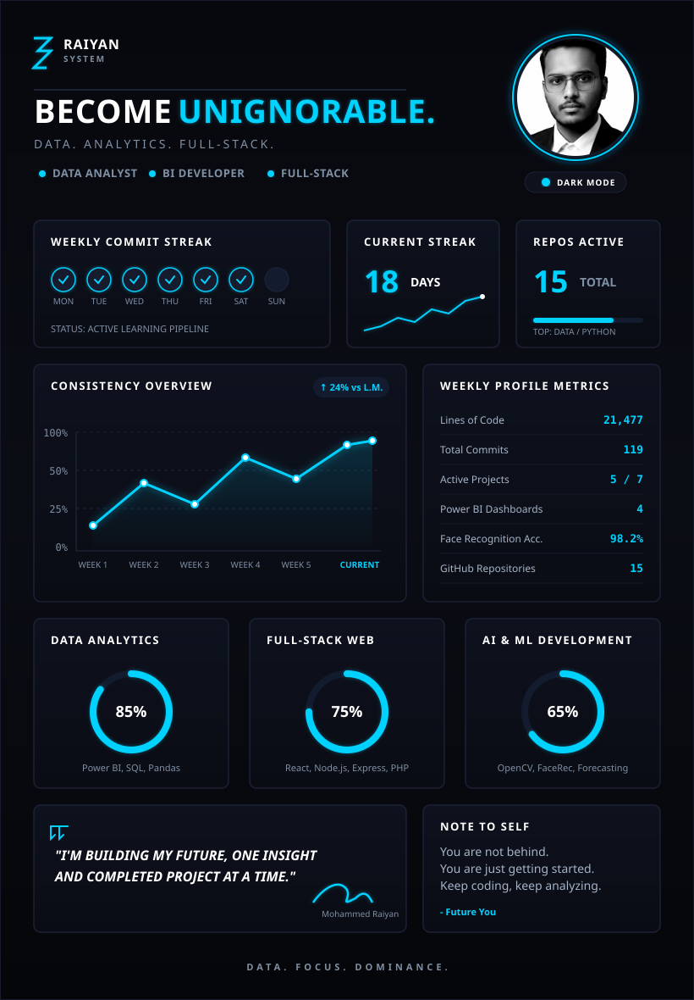

  

# 👋 Hi, I'm Mohammed Raiyan  

🎓 Final-Year **Computer Science Engineering** Student  
📊 Aspiring **Data Analyst | Data Scientist | BI Developer | Full-Stack Developer**  
📍 India  

---

## 🚀 About Me  

I am a passionate Computer Science Engineering student with strong interests in **Data Analytics, Business Intelligence, Automation, Full-Stack Development, and AI-based systems**. I focus on designing end-to-end analytics pipelines, automation agents, and full-stack platforms that turn raw data into actionable business insights.

---

## 🧠 Skills & Technologies  

### 📊 Data Analytics & BI
- **Tools**: Power BI, Tableau, Excel, n8n
- **Techniques**: DAX, Power Query, Data Modeling, ETL Pipelines, KPI Tracking, SLA Compliance
- **Libraries**: Pandas, NumPy, Matplotlib, Seaborn, Plotly

### 💻 Programming & Full-Stack Development
- **Languages**: Python, JavaScript, SQL, PHP, HTML/CSS
- **Frameworks**: React.js, Node.js, Express.js
- **Database**: MySQL

### 🤖 AI, Machine Learning & Computer Vision
- OpenCV, LBPH (Face Recognition), Image Processing
- Time Series Forecasting, Predictive Modeling, Exploratory Data Analysis (EDA)

### 🛠 Tools & Platforms
- Git & GitHub, GitHub Actions (CI/CD), Vercel, InfinityFree, Postman, Google Colab

---

## 📌 Featured Projects  

### 📊 Data Analytics & BI Dashboards
*   **[Operations Performance & Efficiency Dashboard](https://github.com/mohammedraiyan05/Operations-Performance-Efficiency-Dashboard)** (Power BI)
    *   Tracks **task execution, SLA compliance, employee productivity, and delays** in a research and training environment.
    *   Identifies operational bottlenecks and optimizes workload distribution.
*   **[Electronic Sales Automation Pipeline](https://github.com/mohammedraiyan05/Electronic_sales_with_n8n)** (n8n, JS, LLMs)
    *   End-to-end automated pipeline using **n8n**, JavaScript, and LLMs to compute KPIs, generate charts, create AI-driven business summaries, and deliver professional HTML reports via email.
*   **[Hospital Emergency Room Analytics](https://github.com/mohammedraiyan05/Hospital-Emergency-Room-Analytics-Dashboard)** (Power BI)
    *   Interactive dashboard analyzing emergency room patient flow, wait times, satisfaction scores, and demographic trends across monthly and patient-level views.
*   **[YouTube Top Channels Engagement Dashboard](https://github.com/mohammedraiyan05/YouTube-Top-Channel-Videos-Dashboard)** (Power BI)
    *   Advanced data modeling and DAX analysis of **155,000+ YouTube videos** to identify upload timing patterns, view counts, and engagement trends.
*   **[Weather Analytics & Forecasting Dashboard](https://github.com/mohammedraiyan05/Weather-Prediction-Forecasting)** (Power BI & API)
    *   Real-time dashboard using **WeatherAPI** to track 7-day weather conditions, air quality index, and rain probability in a dark-themed UI.
*   **[Sales Performance Analytics](https://github.com/mohammedraiyan05/Sales-Performance-Analysis)** (Power BI)
    *   E-commerce analytics dashboard evaluating category/state-wise revenue trends, product demand, and order cancellation impacts.
*   **[Video Game Sales Dashboard](https://github.com/mohammedraiyan05/video-game-sales-dashboard)** (Tableau)
    *   Interactive genre, platform, and publisher sales comparison showing publisher market share and time-based sales patterns.

### 🤖 Computer Vision & AI / ML
*   **[Face Recognition Based Attendance System](https://github.com/mohammedraiyan05/Face-Recognition-Based-Attendance-System)** (Python, OpenCV)
    *   Real-time attendance platform built using **Tkinter** and the **LBPH algorithm**. Automatically captures student faces, trains local models, and logs attendance with dates and times.
*   **[Customer Behaviour & Churn Analysis](https://github.com/mohammedraiyan05/Customer-Behaviour-Analysis)** (Python & Jupyter)
    *   Exploratory data analysis and demographic segmentation modeling (age, income, loyalty programs, churn risk) to provide business recommendations.
*   **[COVID-19 Trend Forecasting](https://github.com/mohammedraiyan05/COVID-19-Trend-Forecasting-Analysis)** (Python & Jupyter)
    *   Time-series forecasting on global daily confirmed, recovered, and death metrics sourced from Johns Hopkins University.
*   **[IBM HR Employee Attrition & Performance Analysis](https://github.com/mohammedraiyan05/IBM-HR-Analytics-Employee-Dashboard)** (Data Analytics)
    *   Analytical review identifying key attrition drivers and performance indicators in the corporate workplace.

### 🌐 Full-Stack & Automation
*   **[Smart Personal Productivity & Expense Manager](https://github.com/mohammedraiyan05/Smart-Personal-Productivity-Expense-Manager)** (React, Node.js, MySQL)
    *   Full-stack unified dashboard combining task lists, deadline alerts, and expense management with detailed visualization insights.
*   **[CodSoft Web Development Projects](https://github.com/mohammedraiyan05/codsoft-web-development)** (React, Node.js, PHP, HTML/CSS)
    *   Collection of frontend and full-stack tasks including a personal portfolio, calculator, e-commerce front, and job board app.

---

## 🏆 Achievements  

- 🥈 **2nd Place (Twice)** – IoT Project Competition  
- 🧑‍🏫 **Class Representative** – CSE  
- 🎓 **Class Topper** – Higher Secondary  
- 🧠 Participant – Technical Quiz Competitions  

---

## 📚 Currently Learning  

- Advanced Data Analytics & BI Workflows  
- Time-Series Forecasting & Deep Learning  
- Big Data Automation Pipelines (n8n, Airflow)  
- Cloud Computing & Serverless Deployment  

---

## 🎯 Career Goals  

- Excel as a **Data Analyst / Data Scientist / Business Intelligence Engineer**.  
- Build scalable, automated data ingestion and analytics pipelines.  
- Develop intelligent systems that drive data-driven decision-making.  

---

## 📫 Connect With Me  

- 💼 **LinkedIn**: [mohammed-raiyan21](https://www.linkedin.com/in/mohammed-raiyan21/)  
- 📧 **Email**: [mohammedraiyaneajas@gmail.com](mailto:mohammedraiyaneajas@gmail.com)  
- 🌐 **Portfolio**: [mdraiyan.vercel.app](https://mdraiyan.vercel.app/)  
- 💻 **GitHub**: [mohammedraiyan05](https://github.com/mohammedraiyan05)  

---

⭐ **Thanks for visiting my GitHub profile!**  
If you like my projects, feel free to ⭐ star my repositories and connect with me.
